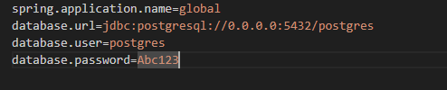

## 3. Pull & config connection string to database application.properties

1. connection String 



Nếu chạy source code ở local máy của bạn thì thay postgres-v16 thành 0.0.0.0 và ngược lại, ví dụ như sau: 

```cmd
database.url=jdbc:postgresql://postgres-v16:5432/postgres
```

 2. Create network docker 
 Chạy lệnh bên dưới để tạo line network 
```cmd
 docker network create line-postgres-5432
```

## 3. connect network
```cmd
docker network connect line-postgres-5432 postgres-v16
```
## 4. Build and run container

cd to folder has dockerfile and open the cmd and run:

```cmd
docker build -t springboot-crud-postgres-service .
```

```cmd
docker run -d  -p 8080:8080 --network line-postgres-5432 springboot-crud-postgres-service
```